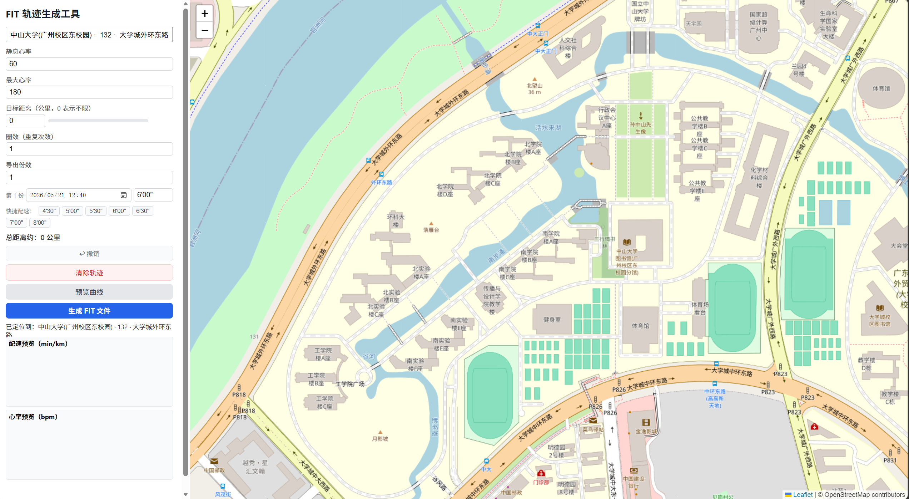
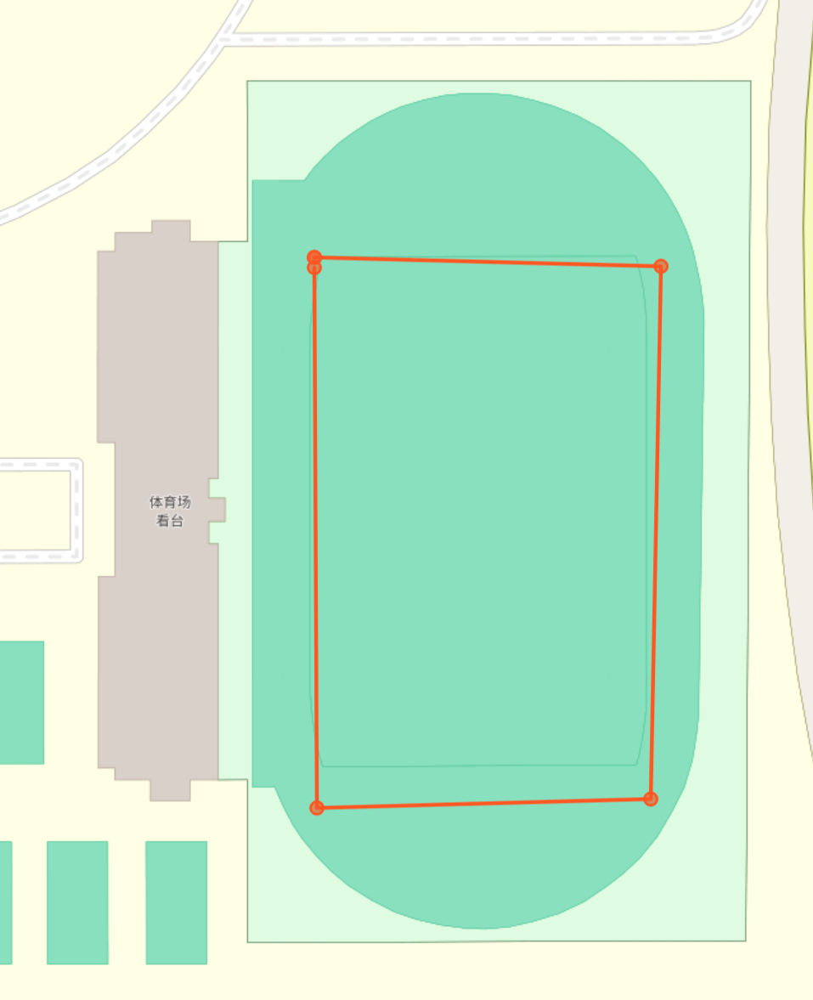

# 校园跑 FIT 数据生成工具

一个本地运行的 FIT 跑步活动文件生成工具。项目通过网页地图绘制跑步轨迹，设置开始时间、配速、心率、圈数和导出份数后，生成可下载的 `.fit` 文件。默认地图中心已设置为中山大学。

> 请务必先阅读本文档中的"免责声明与使用边界"。本项目仅适合学习、测试、演示和个人合法数据处理场景，禁止用于作弊、伪造打卡、欺骗平台或规避任何学校、单位、赛事、保险、健康管理等系统的规则。

## 功能特性

- 在地图上点击绘制跑步轨迹，系统自动连线。
- 默认地图定位到中山大学附近。
- 支持设置静息心率、最大心率、圈数、导出份数。
- 支持为每一份导出文件单独设置开始时间和配速。
- 支持预览配速曲线、心率曲线和轨迹播放。
- 支持一次导出 1 到 10 份 FIT 跑步活动文件。
- 多圈路线会基于已绘制路线重复生成，并加入轻微位置扰动，使轨迹不完全重叠。



放大图片后双击即可产生路径点，依次点击想要的轨迹上的部分点就可练成完整图形



## 技术栈

- Node.js
- Express
- Garmin FIT SDK
- Leaflet
- Chart.js
- OpenStreetMap 地图瓦片

## 项目结构

```text
.
├── public/
│   ├── index.html      # 前端页面
│   ├── main.js         # 地图交互、预览、下载逻辑
│   └── style.css       # 页面样式
├── server.js           # Express 服务与 FIT 文件生成逻辑
├── package.json        # 项目依赖与启动脚本
├── package-lock.json
└── run-fit-tool.cmd    # Windows 一键启动脚本
```

## 环境要求

本仓库不会上传 `node_modules/` 和 `node-v24.12.0-win-x64/`，因此使用者需要先在本机安装 Node.js 环境。

建议环境：

- Node.js 18 或更高版本。
- npm，通常会随 Node.js 一起安装。
- 现代浏览器，例如 Chrome、Edge、Firefox 或 Safari。
- 可访问外部网络。前端地图、图表和地图瓦片依赖 Leaflet、Chart.js、OpenStreetMap 等外部资源，使用地图和预览功能时需要网络连接。

首次运行前需要执行 `npm install`，npm 会根据 `package.json` 和 `package-lock.json` 自动下载并生成 `node_modules/` 目录。这个目录是本地依赖缓存，不需要提交到 GitHub。

## 安装与启动

### 方式一：使用 npm

```bash
npm install
npm start
```

启动成功后，在浏览器访问：

```text
http://localhost:3000
```

### 方式二：Windows 一键启动

确认本机已经安装 Node.js 后，双击运行：

```text
run-fit-tool.cmd
```

如果没有检测到 `node_modules/`，脚本会先执行 `npm install`，然后启动本地服务。若你的本地目录中额外保留了便携版 Node.js 文件夹，脚本也会优先尝试使用它；但公开上传 GitHub 时不建议提交该文件夹。

## 使用方法

1. 启动服务并打开 `http://localhost:3000`。
2. 在右侧地图上依次点击，绘制一条跑步轨迹。
3. 在左侧填写静息心率、最大心率、圈数和导出份数。
4. 在导出列表中为每一份文件设置开始时间和配速。
5. 点击"预览曲线"，检查轨迹、配速曲线和心率曲线。
6. 确认无误后点击"生成 FIT 文件"，浏览器会下载 `.fit` 文件。

生成的 FIT 文件包含跑步活动的时间、经纬度轨迹、距离、速度和心率等基础数据。不同平台对 FIT 文件的解析、导入和展示方式可能不同，具体结果以目标平台实际表现为准。


## 常见问题

### 生成的文件可以导入 Keep 吗？

本项目生成的是标准 FIT 格式跑步活动文件。Keep 或其他运动平台是否允许导入、如何解析、是否展示轨迹和心率，取决于对应平台当时的功能、规则和风控策略。本项目不保证任何第三方平台能够导入或接受生成文件。

### 为什么地图加载不出来？

地图依赖 Leaflet、OpenStreetMap 瓦片和前端 CDN 资源。请检查网络连接，或确认浏览器没有拦截外部资源。

### 为什么生成的数据和真实运动不完全一致？

本项目使用轨迹点、配速、圈数和心率参数计算模拟数据，并加入一定随机波动。它不能替代真实运动设备、GPS 记录、心率传感器或医学/训练分析工具。

## 免责声明与使用边界

请在下载、运行、修改、传播或使用本项目之前，认真阅读并理解以下声明。一旦使用本项目，即视为你已经阅读、理解并同意自行承担相应风险和责任。

### 1. 项目用途声明

本项目仅用于技术学习、FIT 文件格式研究、前端地图交互演示、本地开发测试、个人合法数据处理、运动数据可视化实验等正当场景。项目作者不鼓励、不支持、不同意任何人将本项目用于虚构运动事实、伪造健康记录、伪造校园跑记录、伪造 Keep 运动记录、伪造赛事记录、伪造考勤或打卡数据、规避平台规则、骗取奖励、学分、保险利益、商业利益或其他不当利益。

### 2. 禁止用途

严禁将本项目或由本项目生成的任何文件、数据、截图、接口返回结果用于以下行为：

- 冒充真实运动记录上传至 Keep、校园跑、学校体育系统、单位考勤系统、赛事平台、保险平台、健康管理平台或任何第三方服务。
- 以欺骗、作弊、规避审核、绕过风控、逃避监管或误导他人为目的生成、修改、传播运动数据。
- 违反学校、单位、平台、赛事组织方、服务提供商或法律法规规定的任何行为。
- 侵犯他人隐私、名誉、账号权益、数据权益、知识产权或其他合法权益。
- 将本项目包装为可用于"代跑""刷跑""刷步数""刷运动记录""刷校园跑"等用途的工具、服务或商品。

### 3. 与第三方平台无关联

本项目不是 Keep、Garmin、OpenStreetMap、Leaflet、Chart.js 或任何学校、单位、运动平台、硬件厂商、赛事组织方的官方项目，也未获得上述主体的授权、认可、赞助或背书。文档中出现的相关名称、商标、服务或格式仅用于说明兼容场景或技术背景，其权利归各自权利人所有。

### 4. 平台规则与账号风险

不同第三方平台可能有自己的用户协议、数据真实性要求、反作弊规则、风控机制和账号处理规则。将生成数据上传至第三方平台可能导致导入失败、数据异常、账号限制、记录删除、成绩作废、资格取消、纪律处分、服务封禁或其他后果。任何因使用本项目或生成数据而产生的平台处理、学校处分、合同责任、行政责任、民事责任或刑事责任，均由使用者自行承担。

### 5. 数据真实性与准确性

本项目生成的数据是基于用户输入和程序算法构造的模拟数据，不代表真实 GPS 设备、真实心率设备、真实运动过程或真实健康状态。生成结果可能存在距离误差、速度误差、时间误差、心率误差、轨迹漂移、格式兼容问题或平台解析差异。不得将其作为医学诊断、训练评估、保险理赔、赛事成绩、学校考核、单位考勤或任何高风险决策依据。

### 6. 健康与运动风险

本项目不会评估你的身体状况，也不会给出专业训练建议。请不要因为生成数据而替代真实运动、隐瞒健康风险或误判个人运动能力。任何运动计划、健康管理或康复训练应结合自身情况，并在必要时咨询专业人士。

### 7. 隐私与数据安全

本项目默认在本地运行，但你绘制的轨迹、设置的时间、配速、心率等内容可能反映个人位置、生活规律、校园或居住信息。请勿在公开仓库、截图、Issue、日志或分享文件中泄露个人敏感信息。若你修改项目并部署到服务器，请自行负责访问控制、日志清理、传输加密、数据存储、权限隔离和合规审查。

### 8. 开源发布与二次传播责任

任何人 fork、修改、部署、打包、转载、分发或基于本项目提供服务时，应保留本免责声明，并明确告知使用者合法合规使用边界。二次开发者或传播者不得删除、弱化、歪曲本免责声明，不得诱导他人将本项目用于作弊、欺骗或其他违规违法场景。

### 9. 无担保声明

本项目按"现状"提供，不作任何明示或暗示担保，包括但不限于可用性、稳定性、准确性、完整性、安全性、适销性、特定用途适用性、第三方平台兼容性或持续维护承诺。作者不保证项目无错误、无漏洞、不中断，也不保证第三方服务、依赖库或平台规则不会变化。

### 10. 责任限制

在法律允许的最大范围内，项目作者、贡献者或维护者不对任何因使用、无法使用、修改、传播本项目或使用生成文件而导致的直接、间接、偶然、特殊、惩罚性或后果性损失承担责任，包括但不限于账号损失、学业处分、成绩取消、经济损失、数据丢失、隐私泄露、设备故障、业务中断、第三方索赔或法律责任。

### 11. 侵权与下架

如果你认为本项目中的内容、名称、说明、依赖使用方式或其他部分侵犯了你的合法权益，请通过 GitHub Issue 或仓库维护者提供的联系方式提出，并提供必要证明。维护者将在合理范围内进行核查、修改或移除相关内容。

### 12. 最终使用责任

你必须确保自己使用本项目的目的、方式和结果符合所在地法律法规、学校或单位规章制度、第三方平台用户协议以及基本诚信原则。任何不当使用造成的全部后果均由使用者自行承担，与项目作者和贡献者无关。
